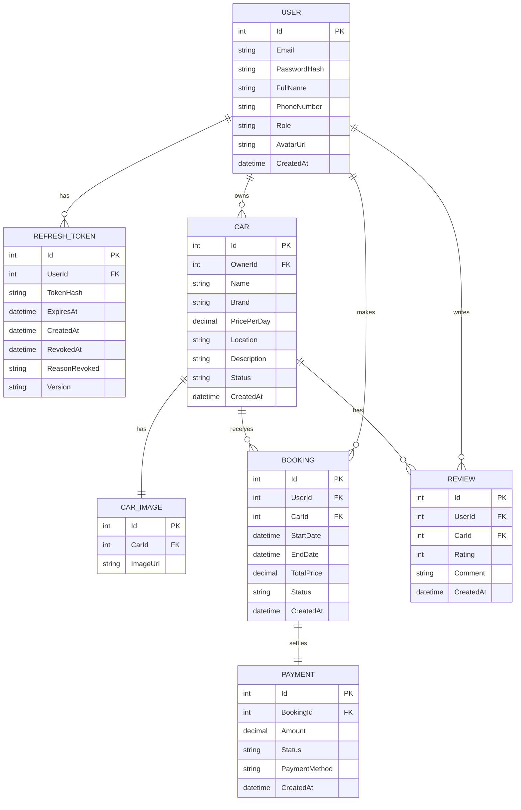

# TÀI LIỆU ĐẶC TẢ YÊU CẦU PHẦN MỀM (SRS)
## DỰ ÁN: SMART CAR RENTAL SYSTEM

---

### 1. GIỚI THIỆU (INTRODUCTION)

#### 1.1. Mục đích (Purpose)
Tài liệu này đặc tả chi tiết các yêu cầu nghiệp vụ, chức năng và phi chức năng cho hệ thống **Smart Car Rental System** (Hệ thống Thuê xe tự lái). Tài liệu này được sử dụng làm căn cứ thiết kế hệ thống, cơ sở dữ liệu, phát triển API và kiểm thử phần mềm cho toàn bộ dự án.

#### 1.2. Phạm vi hệ thống (System Scope)
Hệ thống **Smart Car Rental System** là nền tảng kết nối trực tiếp giữa **Chủ xe (Car Owner)** muốn tối ưu hóa doanh thu từ phương tiện nhàn rỗi và **Khách thuê xe (Customer)** có nhu cầu di chuyển. Hệ thống hỗ trợ tìm kiếm xe thông minh, đặt lịch trực tuyến, thanh toán hóa đơn và đánh giá phản hồi nhằm nâng cao chất lượng dịch vụ.

#### 1.3. Đối tượng độc giả (Target Audience)
- **Đội ngũ phát triển (Developers)**: Sử dụng để lập trình chức năng và database.
- **Đội ngũ kiểm thử (Testers/QA)**: Sử dụng để thiết kế kịch bản test (Test cases).
- **Khách hàng/Đối tác**: Sử dụng để nghiệm nghiệm thu sản phẩm.

---

### 2. MÔ TẢ TỔNG QUAN (OVERALL DESCRIPTION)

#### 2.1. Kiến trúc hệ thống tổng quát
Dự án được xây dựng theo mô hình **Clean Architecture** sử dụng công nghệ ASP.NET Core Web API và cơ sở dữ liệu PostgreSQL (lưu trữ trên dịch vụ đám mây Supabase).
- **CarRental.Domain**: Chứa các thực thể cốt lõi (User, Car, Booking, Payment, Review, RefreshToken).
- **CarRental.Application**: Xử lý logic nghiệp vụ, chứa các DTOs, interface và service.
- **CarRental.Infrastructure**: Xử lý kết nối cơ sở dữ liệu EF Core, lưu trữ cấu hình.
- **CarRental.API**: Cung cấp các RESTful API phục vụ client app (Web/Mobile).

#### 2.2. Các tác nhân sử dụng hệ thống (Actors)
1. **Khách hàng (Customer)**: Người dùng có nhu cầu thuê xe. Họ có quyền xem danh sách xe, tìm kiếm xe, đặt xe, thực hiện thanh toán và đánh giá sau khi kết thúc chuyến đi.
2. **Chủ xe (Car Owner)**: Người dùng đăng ký xe lên hệ thống để cho thuê. Có quyền quản lý danh sách xe của mình, quản lý trạng thái xe, và duyệt/theo dõi lịch đặt xe từ khách hàng.
3. **Quản trị viên (Admin)**: Người quản lý hệ thống. Có quyền quản trị người dùng, duyệt thông tin xe mới đăng ký để đảm bảo an toàn, quản lý các giao dịch thanh toán và xem báo cáo doanh thu.

---

### 3. YÊU CẦU CHỨC NĂNG (FUNCTIONAL REQUIREMENTS)

#### 3.1. Phân hệ Xác thực & Phân quyền (Authentication & Authorization)
Hệ thống sử dụng cơ chế bảo mật kết hợp JWT Access Token (ngắn hạn) và **Refresh Token lưu trữ dạng SHA-256 mã hóa thông qua HttpOnly Cookie** (dài hạn).

- **Đăng ký tài khoản (Register)**:
  - Cho phép người dùng đăng ký tài khoản mới bằng Email, Mật khẩu, Họ tên, Số điện thoại.
  - Phân quyền mặc định sau khi đăng ký thành công là `Customer`.
  - Mật khẩu phải được hash an toàn bằng thư viện BCrypt trước khi lưu vào database.
- **Đăng nhập (Login)**:
  - Xác thực bằng Email và Password.
  - Sau khi đăng nhập thành công, trả về Access Token trong JSON response body và thiết lập HttpOnly Secure Cookie chứa Refresh Token.
  - Cơ chế thu hồi (Revoke) tất cả các refresh token đang hoạt động khác của người dùng khi có phiên đăng nhập mới (Chính sách: 1 phiên hoạt động duy nhất cho mỗi user tại một thời điểm).
- **Làm mới Token (Refresh Token)**:
  - Đọc Refresh Token từ cookie, kiểm tra tính hợp lệ và thời hạn.
  - Thực hiện cơ chế xoay vòng Refresh Token (Token Rotation) để cấp Access Token mới và Cookie Refresh Token mới.
  - Phát hiện hành vi sử dụng lại token cũ bằng kỹ thuật kiểm soát phiên bản đồng thời (Optimistic Concurrency với PostgreSQL `xmin`).
- **Đăng xuất (Logout)**:
  - Thu hồi trạng thái hoạt động của Refresh Token trong cơ sở dữ liệu và xóa cookie phía client.

#### 3.2. Phân hệ Quản lý Xe (Car Management)
Phục vụ cho **Chủ xe (Car Owner)** và **Quản trị viên (Admin)**.

- **Đăng ký xe mới (Create Car)**:
  - Chủ xe cung cấp các thông tin: Tên xe, Hãng xe (Brand), Giá thuê theo ngày (PricePerDay), Địa điểm xe (Location), Mô tả chi tiết (Description) và Hình ảnh xe (CarImage).
  - Trạng thái ban đầu của xe khi đăng ký là `Pending` (Chờ Admin duyệt) hoặc `Available` tùy theo quy trình nghiệp vụ được cấu hình.
- **Cập nhật thông tin xe**:
  - Chủ xe có thể chỉnh sửa giá thuê, địa điểm, hình ảnh và trạng thái của xe (ví dụ: `Available` - sẵn sàng cho thuê, `Maintenance` - đang bảo dưỡng, `Rented` - đang được thuê).
- **Duyệt xe (Admin Approve)**:
  - Admin xem xét thông tin xe và phê duyệt để hiển thị xe lên danh sách tìm kiếm công khai.

#### 3.3. Phân hệ Tìm kiếm & Đặt xe (Search & Booking)
Phục vụ cho **Khách hàng (Customer)**.

- **Tìm kiếm xe**:
  - Bộ lọc nâng cao: Tìm kiếm theo Địa điểm (Location), Thương hiệu (Brand), Khoảng giá thuê (Price Range) và Thời gian cần thuê (Từ ngày - Đến ngày).
- **Đặt xe (Create Booking)**:
  - Khách hàng chọn xe, nhập thời gian thuê (`StartDate` và `EndDate`).
  - Hệ thống tự động tính toán tổng số tiền dựa trên công thức: `TotalPrice = PricePerDay * Số ngày thuê`.
  - Kiểm tra trạng thái xe để tránh đặt trùng lịch (Double Booking). Nếu xe đã được thuê trong khoảng thời gian đó, hệ thống sẽ báo lỗi.
  - Trạng thái Booking ban đầu: `Pending` hoặc `Confirmed`.

#### 3.4. Phân hệ Thanh toán (Payment)
- **Tạo giao dịch thanh toán**:
  - Hóa đơn thanh toán (`Payment`) được liên kết chặt chẽ với đơn đặt xe (`Booking`).
  - Lưu trữ số tiền thanh toán (`Amount`), Phương thức thanh toán (`PaymentMethod` như Ví điện tử, Chuyển khoản, hoặc Tiền mặt) và trạng thái giao dịch (`Status`: `Pending`, `Completed`, `Failed`).

#### 3.5. Phân hệ Đánh giá & Phản hồi (Reviews & Ratings)
- **Đánh giá sau chuyến đi**:
  - Sau khi chuyến đi hoàn thành, Khách hàng có quyền đánh giá xe bằng cách chấm điểm từ 1 đến 5 sao (`Rating`) kèm theo nhận xét chi tiết (`Comment`).
  - Điểm đánh giá trung bình sẽ được hiển thị trên trang thông tin xe của Chủ xe để tăng độ tin cậy.

---

### 4. SƠ ĐỒ THỰC THỂ CƠ SỞ DỮ LIỆU (ERD MAPPINGS)

Hệ thống lưu trữ dữ liệu với các thực thể liên kết như sau:

---

### 5. YÊU CẦU PHI CHỨC NĂNG (NON-FUNCTIONAL REQUIREMENTS)

#### 5.1. Bảo mật dữ liệu (Security)
- Toàn bộ kết nối API phải thông qua giao thức bảo mật HTTPS ở môi trường Production.
- JWT Access Token có thời gian sống ngắn (ví dụ: 15 phút), Refresh Token có thời hạn sống dài hơn (ví dụ: 7 ngày) nhưng được cấu hình bảo mật tối đa (HttpOnly, Secure, SameSite=Strict).
- Mật khẩu người dùng được mã hóa bằng thuật toán băm một chiều BCrypt bảo mật cao.

#### 5.2. Tính nhất quán & Tranh chấp đồng thời (Concurrency Control)
- Để tránh các rủi ro bảo mật liên quan đến Refresh Token (chẳng hạn như tấn công Replay Attack), hệ thống sử dụng trường phiên bản `xmin` của PostgreSQL kết hợp với EF Core `.IsRowVersion()`. Nếu có hai yêu cầu sử dụng Refresh Token đồng thời, yêu cầu thứ hai sẽ bị từ chối ngay lập tức do lỗi tranh chấp dữ liệu (Concurrency Conflict).

#### 5.3. Khả năng bảo trì & Mở rộng (Maintainability & Extensibility)
- Hệ thống áp dụng triết lý Clean Architecture độc lập với cơ sở dữ liệu và giao diện giúp kiểm thử tự động dễ dàng và thuận tiện thay thế hoặc nâng cấp công nghệ ở tầng ngoài.
